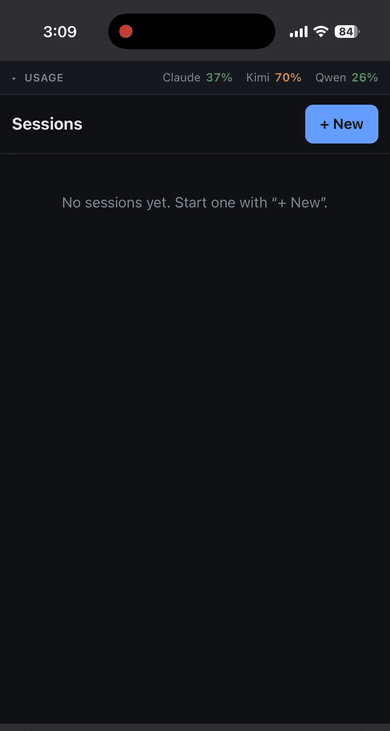

# multi-agent-hub

One mobile-first web console for three coding-agent CLIs — **claude**, **kimi**, and **qwen** —
running on your own hardware, reachable from your phone, exposed to nothing.

It runs on your machine and drives the CLIs you already have installed, authenticating as *you*: it
shells out to each CLI, so every turn spends your existing subscription or plan. No API keys, no
second login, no cloud service in the middle.

<p align="center">
  
</p>

<p align="center"><em>Real turns against a real repo, driven from a phone over a private tailnet.</em></p>

## Why

The three CLIs are individually excellent and collectively unmanageable: three terminals, three
session models, three separate places to check how much quota is left, and none of them reachable
from the couch. This is one session list, one usage dashboard, and one interface that works on a
phone.

## What it does

- **One session list across all three agents.** Start a session, pick which agent runs it and which
  repo it runs in, and switch model or permission mode per session.
- **Unified usage dashboard.** Claude's 5-hour and weekly limits, Kimi's weekly and rolling-window
  quota, and Qwen's credit consumption in one strip — with bars colored by *pace* rather than
  absolute consumption, because 60% is comfortable on day five and alarming on day one.
- **Honest gaps.** Where a number genuinely cannot be determined it renders as a dash plus an
  explanation, never as a zero. A fabricated denominator is worse than a missing one.
- **A notification when a turn ends.** Optional Discord webhook, per session. It distinguishes
  *finished* from *needs you*, so a question waiting on you looks different from a completed job.
- **Structured, phone-friendly transcripts.** Tool calls, results, and thinking each collapse
  independently. Agent prose is rendered as markdown; nothing is dropped silently.
- **Attachments.** Paste a screenshot, drag a file, or pick one — it reaches the agent as a path it
  can read with its own file tool.

## Quick start

No Tailscale, no service install, one CLI is enough:

```sh
npm install
npm run build:web
npm start                 # http://127.0.0.1:4319
```

That is the whole localhost path. Open it, pick a repo, and send a prompt. `cp .env.example .env`
only matters once you want turn-end notifications or exact Qwen credit quota.

## Requirements

- Node 22+
- At least one of `claude`, `kimi`, `qwen` on your `PATH`, already logged in. The hub degrades per
  agent — a missing CLI only breaks that agent's sessions.
- macOS or Linux. Only the optional launchd service install (`deploy/`) is macOS-specific.
- Tailscale, *only* if you want to reach it from another device.

## Access it from anywhere

The server binds to `127.0.0.1` and nothing else. To reach it from your phone, put it on your own
private network rather than on the internet:

```sh
tailscale serve --bg --https=9443 http://127.0.0.1:4319
tailscale serve status     # prints the https://<machine>.<tailnet>.ts.net:9443 URL
```

Tailscale terminates TLS with a real certificate and restricts reachability to devices on your
tailnet. Open the printed URL on your phone; Safari → Share → Add to Home Screen gives it an app
shell, since the page declares the iOS web-app meta tags.

**Always pass `--https` explicitly.** Without it the mapping takes the tailnet's default `:443`,
which is easy to collide with on a node that serves anything else — and two live URLs for one
service is how you update one and keep testing the other.

**Never use `tailscale funnel`.** See below.

## Security

Read this part before you expose it to anything.

The hub is an **unauthenticated shell-equivalent**. Anyone who can reach it can run arbitrary
commands in any repo it can see, as you. There is no login, no session token, and no per-tool
approval, and adding one would be theater on top of the real control:

- It binds to `127.0.0.1` **only**, and the bind address is not configurable. Binding `0.0.0.0`
  would put a remote shell on your LAN.
- Remote access is delegated entirely to a private overlay network — Tailscale supplies both the TLS
  and the reachability boundary. The security property is "only my own devices can route to it."
- `tailscale funnel` publishes to the public internet. It is never correct here.

Every session runs in a **fully permissive** mode by default, because a headless turn has nobody to
answer a permission prompt — anything requiring approval is auto-denied, and a denial is
indistinguishable from a genuine failure in the transcript. Where no human is present to approve,
the honest choices are full permission or none; a middle setting mostly manufactures misleading
transcripts. `plan` mode is available per session when you want a read-only one.

The usage collectors touch credentials, and it is worth knowing which:

| agent | what it reads | what it writes |
|---|---|---|
| claude | `~/.claude/usage-cache.json` | nothing |
| kimi | the Kimi CLI's OAuth token, and Kimi's usage API | **rewrites the CLI's credentials file** on token refresh |
| qwen | a browser session cookie you supply, or a local token ledger | nothing |

Kimi rotates refresh tokens: each refresh invalidates the one it replaced, so persisting the new one
is a correctness requirement rather than bookkeeping — discard it and the Kimi CLI's own auth breaks
at the next refresh. The write merges into the existing JSON, is atomic (temp file + rename), and is
mode `0600`. If you would rather nothing but the Kimi CLI touched that file, set
`USAGE_PROVIDERS=claude,qwen`.

Tokens are never logged, never sent to the browser, and never leave their provider module.

## How it works

Every turn is a single one-shot CLI invocation (`<cli> -p --output-format stream-json`), resumed by
the CLI's own session id. Adapters normalize three JSON dialects into one event stream, so nothing
above `server/src/adapters/` knows which agent it is talking to.

```
browser ──WebSocket──> server ──spawn(cwd: repo)──> claude | kimi | qwen
   ▲                     │                              │
   └── normalized ───────┴────── adapter.mapLine() ─────┘
       event stream            (3 dialects → 1 union)
```

Because the hub holds no long-lived agent processes, sessions survive a server restart and there are
no orphans to clean up. The tradeoff: permission posture is chosen per session up front rather than
approved mid-turn.

State is files, not a database — a session registry and one event log per session under `DATA_DIR`,
written atomically.

Three things the CLIs disagree about, which shaped the design more than anything else:

- **When an agent names its session is dialect.** claude and qwen announce theirs in an opening init
  frame; kimi emits no init frame at all and discloses its id on the stream's last line. So the turn
  runner reports the id from *every* exit path, interrupt included — keying on an init frame means
  every kimi turn silently starts a brand-new session that remembers nothing.
- **What you spawn is not always the agent.** `qwen`'s binary is a launcher that spawns the real CLI,
  which spawns another process of its own. Killing the direct child leaves the actual agent running
  and reparented to init — still burning quota, still editing your repo. Turns therefore get their
  own process group and are signalled as a group.
- **The weakest agent picks the design.** Attachments land *inside* the session's repo because `qwen`
  confines its file tools to the workspace root and has no `--add-dir` to widen it. Storing them
  anywhere else would make a third of the agents unable to read their own attachments.

[`docs/ADAPTERS.md`](docs/ADAPTERS.md) documents the adapter interface, the full dialect table, and
what it takes to add a fourth CLI. [`docs/DECISIONS.md`](docs/DECISIONS.md) records why each of these
tradeoffs was made, and what was rejected.

## Configuration

Everything is environment variables with working defaults; see
[`.env.example`](.env.example) for the annotated list. The ones most people touch:

| Key | Purpose |
|---|---|
| `PORT` | Hub port. Default `4319`. |
| `REPO_ROOTS` | Colon-separated roots scanned for git repos. Default: your home directory. |
| `DISCORD_WEBHOOK_URL` | Turn-end notifications. Blank disables them. |
| `USAGE_PROVIDERS` | Which agents' quota to collect. Unset means all three. |
| `QWEN_CONSOLE_TICKET` | Qwen's real credit quota. Without it, the card shows local token counts. |

**Never set `ANTHROPIC_API_KEY`** in `.env` or in the shell that launches the hub. The Claude CLI
prefers it over your subscription's OAuth credentials and would bill the API for every turn. The
server strips it from the child environment as a backstop; don't rely on that.

## Running it as a service (macOS, optional)

```sh
bash deploy/install.sh     # launchd user agent + tailscale serve
npm run deploy             # afterwards: one command from edit to live
```

`deploy.sh` builds the frontend, restarts the service, re-asserts the Tailscale mapping, and then
*proves* the result — it health-checks, then compares the fingerprinted bundle name in the freshly
built `index.html` against what the server actually hands out. Doing two of those three steps is the
failure mode it exists to prevent: `tsx` does not hot-reload under launchd, and the server only ever
serves `web/dist`.

## Development

```sh
npm run dev             # server (tsx watch) + vite, concurrently
npm run typecheck       # server + web
npm test                # unit tests
bash scripts/verify.sh  # the full gate: typecheck, tests, build, end-to-end smoke
```

The smoke boots the real server against a throwaway data dir and exercises every endpoint, using a
stub CLI first on `PATH` so it costs **no agent turns**.

## What this is not

Not a framework, not a hosted product, and not multi-user. It is one operator, one machine, and no
plans to be otherwise — that assumption is what lets the security model be "a private overlay
network" instead of an auth system.

Not currently wired: slash commands (`/compact`, `/model`, …), mid-turn permission approval, and the
`rate_limit_event` frames Claude emits, which are parsed but unused.

## Related

- [agent-validation-harness](https://github.com/maxwellcsutton/agent-validation-harness) — the
  cross-family LLM-as-judge gates those sessions run under. This is the console that pilots them.

## License

MIT — see [LICENSE](LICENSE).
